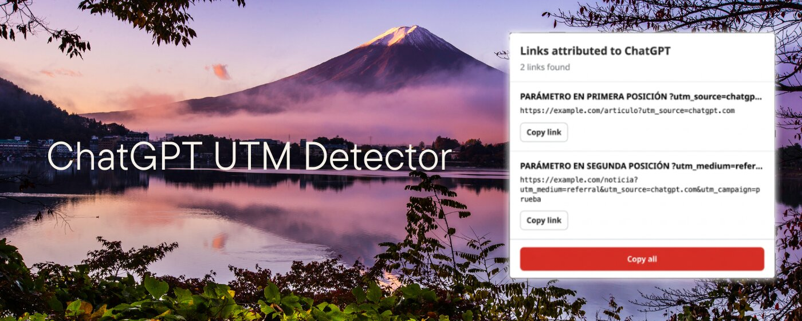

# ChatGPT UTM Detector

A minimal Google Chrome extension that detects links on the current page whose `utm_source` parameter has the exact value `chatgpt.com`.

## Screenshot



## How it works

- The icon remains gray when no matches are found.
- The icon turns red when at least one link attributed to ChatGPT is detected.
- Clicking the icon displays the detected links and their visible text.
- Each result includes a button for copying its URL.
- The **Copy all** button copies every URL, one per line.
- Duplicate links are displayed only once.
- The extension scans the page again whenever its content changes.

Detection works regardless of the parameter's position. For example, both of the following variants are recognized:

```text
https://ejemplo.com/?utm_source=chatgpt.com&utm_medium=referral
https://ejemplo.com/?utm_medium=referral&utm_source=chatgpt.com
```

## Installation

1. Extract the ZIP archive.
2. Open `chrome://extensions/` in Google Chrome.
3. Enable **Developer mode**.
4. Click **Load unpacked**.
5. Select the `chatgpt-utm-detector` folder.
6. Pin the extension to the toolbar so you can easily see the icon change.

## Permissions

The extension needs to read the content of HTTP and HTTPS pages to detect links before the icon is clicked. All analysis takes place locally in the browser. The extension does not collect, store, or transmit any data.

Chrome does not allow content scripts to run on internal pages such as `chrome://extensions/` or on the Chrome Web Store.
